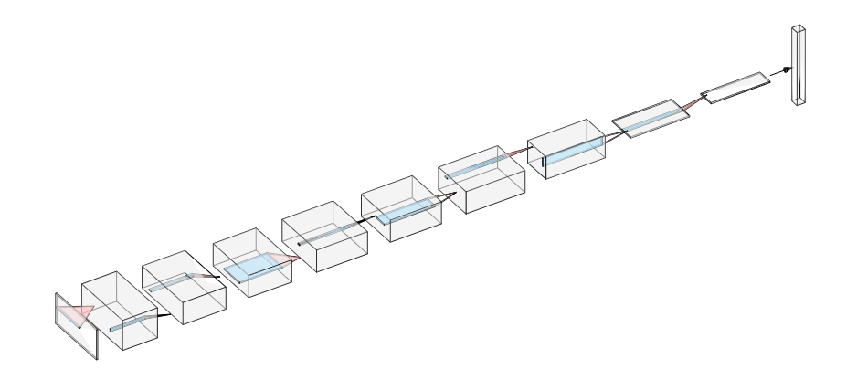
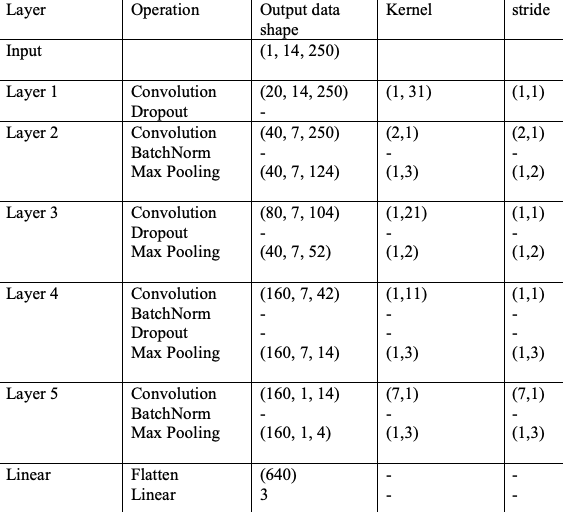
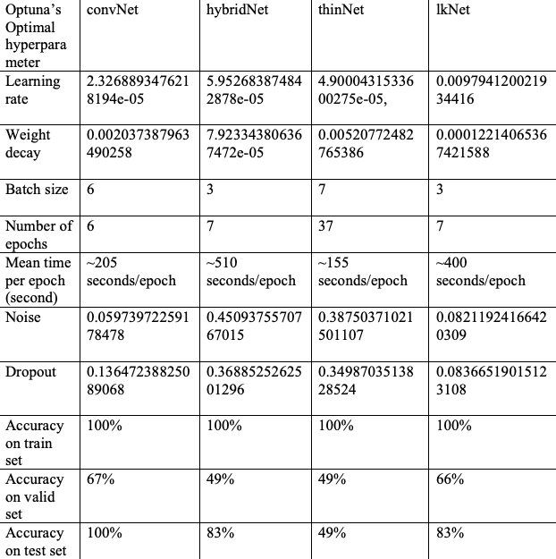

# Variations of Convolutional Neural Networks in Sleep EEG Signal Analysis

### Summary

Paper: [Investigate brain electroencephalogram signal classification during dreamless sleep, dream sleep and lucid sleep using variations of convolutional neural network](https://uwoca-my.sharepoint.com/:f:/g/personal/knguy52_uwo_ca/Em3re2KbOiZLvWrnj78xJWEB1OE-Iz4PRysAl_tijENl3Q?e=CPkAEC)

This work is a modified version of [Kazakova and Sundgren's CNN for EEG classification project](https://github.com/CNN-for-EEG-classification/CNN-EEG).

The goal of this modification is to build and train model that is capable to classify sleep electroencephalography (EEG) into three categories: dreamless sleep, dream sleep and lucid sleep. This project features 4 architectures (convNet, hybridNet, thinNet and lkNet) for a multiclass (3) classifiers. Pytorch API was used for bulding the CNN and the Scikit-learn library to supplement data processing and performance analysis methods. [Dataset](https://uwoca-my.sharepoint.com/:u:/g/personal/knguy52_uwo_ca/EVOY54asXcNNn8T2N5XDSBoBrdFi3C2EmL4sI4mr3dhOIA) is combined and generatively desampled to ensure the balance between each categories. The [original dreamless and dream sleep data](https://doi.org/10.6084/m9.figshare.22086266) was collected by Scarpelli et al. for their paper [Electrophysiological Correlates of Dream Recall During REM Sleep: Evidence from Multiple Awakenings and Within-Subjects Design](https://pmc.ncbi.nlm.nih.gov/articles/PMC7682606/). The original [lucid sleep data](https://doi.org/10.6084/m9.figshare.22106123) was collected by Konkoly et al., presented in their paper [Real-time dialogue between experimenters and dreamers during REM sleep](https://www.sciencedirect.com/science/article/pii/S0960982221000592). Checkpoints for all 4 model architectures can also be found [here](https://uwoca-my.sharepoint.com/:u:/g/personal/knguy52_uwo_ca/ETe3asm7Ll9JhUNYfg8goUgBeSpBynUurmaMFLav-sB2_Q?e=IFqg91). The tensors created from the dataset can be found [here](https://uwoca-my.sharepoint.com/:u:/g/personal/knguy52_uwo_ca/EZMkcs5FlnlGu-H5Se9HO6UBhsRGbsbbUf4Vhb9-QjJ8Dw?e=CNH6kX).

### Code
* `edf_to_txt_converter.ipynb`: a EDF to TXT converter to generate EEG in raw tab-separated txt file to be used by `dataLoader.py`
* `dataLoader.py`: The dataloader that creates a Pytorch compatible tensor from the raw tab-separated txt file. Dataloader has to be ran to produce a tensor that would then be used as an input for one of 4 CNN models (convNet, lowKernelNet, thinNet, or thinNet).
* `convNet.py`: the main 6-layer CNN architechture, with 5 convolutional layers and 1 fully connected layer. Dropout and batch normalization are applied for regularization. And downsampling was performed by max pooling.
* `hybridNet.py` : An alternative to convNet. The network is both an autoencoder and classifier, with the classifier using the latent space representation from the autoencoder as the input for classification. Using this hybrid architecture approach, we found that a marginal improvement to overall test set accuracy was possible.
* `thinNet.py`:  A lightweight version of convNet, where there are only 4 convolutional layers with fewer filters. 
* `lowKernelNet.py` A modified version of convNet, with 5 convolutional layers, where kernel sizes are smaller and less filters to increase the computational efficiency. 
* `trainConvNet.py`: The pipeline for training and testing the muplticlass classifier models. It can be used to train and validate any of the 4 architectures.
* `testConvNet.py`: A pipeline only for validating and testing any of the 4 architectures. Requires checkpoint files to run.
* `modelOptimizer.py`: Ultilize [Optuna library](https://optuna.org/) to generate combinations of hyperparameters to train and verify models' accuracies. This was used as an attempt to find the optimal hyperparameters for each of the architecture. 
* `modelsTrainer.py` : Train, validate and test the models with variations of hyperparameters. Compare and contrast the influence of each of the hyperparameter. Run using command `python modelsTrainer.py [OPTION]` where option is a digit from 1 to 4: 
1. convNet
2. hybridNet
3. thinNet
4. lkNet (Low Kernel Net)
* `requirements.py`: Contains required dependencies to run this project. Recommend installing this in a conda environment, instructions on creating an environment can be found [here](https://docs.conda.io/projects/conda/en/latest/user-guide/tasks/manage-environments.html).

#### Requirements
* Python 3.7 
* Other dependencies can be found in requirements.txt 
* Install by running `pip install -r requirements.txt`

### CNN architecture

  
  
   
    <em> The basic structure of the convNet class. All other networks were derivatives of convNet. (first figure is from Kazakova and Sundgren's CNN for EEG classification project) </em>
 

###  Data Generative Downsampling as a way to downsample while producing more samples
Data balancing - To maintain a balanced number of data samples for each category, we selected 21 random samples from dreamless sleep and dream sleep datasets to represent each category respectively. Each of the category is separated into 3 sets: training set (17 samples for each category), valid set (2 samples for each category) and test set (2 samples for each category).
Data Extraction - Since the data collected is in European Data Format (EDF) and the dataLoader.py only works with txt files, we developed edf_to_txt_converter.ipynb to convert EDF files into 3 raw tab-separated txt files: train_250.txt, valid_250.txt and test_250.txt, each contains all the data across 3 categories (dreamless, dream, and lucid) separated by model training purposes (training, validating, and testing respectively). Since all three dataset only share 14 channels in common (Fp1, F3, F7, Fp2, F4, F8, C3, C4, O2 ,Fz, Cz, Pz, Oz, EMG), all other channels are removed in the process to make the training data more lightweight and ensuring the samples across the dataset provide information in the same varibles. Some samples miss one or two channels from the above list, which the channels are artificially added accordingly, which the datapoints are all zero’s. 
Random Sampling – All samples’ channels are varied in term of number of datapoints and frequency, ranging anywhere between 70, 250 datapoints and 425, 000 datapoints. To ensure data balancing, for samples that have more than 70, 250 points, by random sampling, we randomly selected exactly 70, 250 to represent that channel in that sample. We ensure the order of the datapoints are consistent to avoid feeding wrong data pattern into the model. 
Generative Desampling – Unfortunately, 70, 250 datapoints each channel were still too heavy and not particularly useful for training for a small number of samples, so we developed a method called generative desampling, where we desample the data for each channel per sample down to 250 points each channel. However, the removed datapoints are used to generate new samples, resulting in 281 new samples generated for each original sample. In total, there were 3 (categories) x 21 (samples per category) x 281 (281 new samples per original sample) = 17, 703 samples. 14331 samples for training set (roughly 81% of total dataset), 1686 samples for validating set and 1686 samples for testing set (roughly 9.5% each).
Tensor Generation – dataLoader.py was slightly modified to generate tensor with the above 14 channels, where channels exclusion was removed to make use of all available channels. This code had to be run to generate tensors that can be used for training, validating, and testing. The generated data are stored in scratch/data and scratch/target accordingly, where data contains the input and the target contains the labels.

### Attempt to Obtain Optimized Hyperparameters with Optuna
In file modelOptimizer.py, as an attempt to find the optimal training hyperparameters, Optuna library was used to generate a variety of hyperparameter combinations and apply to each of the models. All the models were trained with a smaller subset from train set (3372 out of 14, 331 samples from the training set), then were validated using the valid set. For a training session, if there exists an epoch where the accuracy on the valid set is larger than 80%, the hyperparameters for that training session are recorded in modelsTrainer.py (this process is done by hand to give some flexibility). A series of training and validating accuracies were recorded and then graphed to determine the optimal number of epoch of the training session right before when the model started to be overfit to the training set and the accuracy on the valid set drops. The determined number of epoch is also recorded in modelsTrainer.py as optimized hyperparameters. The models are trained on the whole training datast using these optimal hyperparameters

### Hybrid autoencoder for forced feature extraction
This is a hybrid model modified from convNet, with convolutional layers for feature extraction, fully connected layer for classification, and a decoder for reconstruction. The classifier uses the latent space representation from autoencoder as the input for classification. The first half is the same 5 layer used in ConvNet architecture, but the second half contains deconvolutional layers. According to their original description, the marginal improvement to overall test set accuracy was possible. 
It has encoder (series of convolutional layers to extract features from input), central layer (fully connected layer that acts as a bottleneck for feature representation), classifier output (a fully connected layer for classification), and a decoder (a series of transposed convolutional layers to reconstruct the input data).

### Training Result 

  

   
    <em> Accuracy result </em>
 
